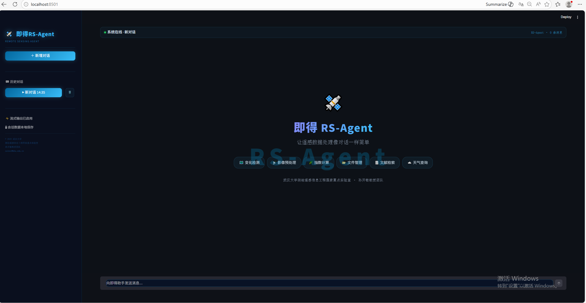

# 🛰️ 即得 RS-Agent

### 感知万物，所见即得
### *Perceive Everything, Get What You See*

 

**让遥感数据处理像对话一样简单**
**Making Remote Sensing as Simple as a Conversation**
 
Wei Cui 1, Tao He 1, Ruosong Long2, Yu Duan1, Ziang Wang1, Fuyu Li1, Kaimin Sun1

1 State Key Laboratory of Information Engineering in Surveying, Mapping and Remote Sensing, Wuhan University

2 School of Computer Science , Wuhan University
 

[演示视频 / Demo](#) · [功能介绍 / Features](#功能介绍--features) · [开发计划 / Roadmap](#开发计划--roadmap) · [联系我们 / Contact](#联系我们--contact)

---

> ⚠️ **预览版声明 / Preview Notice**：当前为 v0.1.0-preview，功能持续更新中，欢迎 Star 关注进展。
> This is v0.1.0-preview. Features are actively being developed. Star us to stay updated.

---

## 简介 / Introduction

**即得 RS-Agent** 是一款面向遥感领域的 AI 智能体，支持通过自然语言对话完成遥感影像处理任务。无需记忆复杂命令，直接告诉它你想做什么。

**RS-Agent** is an AI agent designed for the remote sensing domain. It enables users to complete remote sensing image processing tasks through natural language conversation — no complex commands needed, just tell it what you want.

---

## 功能介绍 / Features

| 类别 / Category | 功能 / Functions |
|------|------|
| 🛰️ **变化检测 / Change Detection** | 多时相变化检测（差值/比值/CVAPS）、变化面积统计、掩膜生成、多时相自动配对 |
| 🌿 **指数计算 / Index Calculation** | NDVI、NDWI、NDBI、EVI、SAVI 一键计算，支持自定义波段 |
| 🔧 **影像预处理 / Preprocessing** | 辐射校正、几何校正、影像配准、裁剪、重采样 |
| 🎨 **波段处理 / Band Processing** | 多波段合成、波段提取、真彩色/假彩色合成 |
| 🗺️ **分类与分割 / Classification** | 土地覆盖分类、地物目标分割与提取、面积统计 |
| 📡 **影像信息 / Image Info** | 波段统计、坐标系读取、分辨率查询、元数据解析 |
| 🔄 **格式转换 / Format Conversion** | GeoTIFF/PNG/JPEG/HFA/IMG 格式互转 |
| 📂 **数据管理 / Data Management** | 批量影像列举、多时相配对、按关键词搜索 |
| 🖼️ **影像预览 / Image Preview** | TIF/PNG/JPG 在线预览，多波段自动拉伸，缩放拖拽 |
| 🤖 **视觉理解 / Visual Understanding** | VL 模型直接读图，自然语言描述影像内容与地物识别 |
| 📐 **空间分析 / Spatial Analysis** | 变化面积计算（平方米/公顷/平方千米）、像素统计 |
| 💻 **文件管理 / File Management** | 文件列表、搜索、重命名、移动、复制、批量操作 |
| 📚 **文献检索 / Literature Search** | arXiv 文献一键搜索与下载 |
| 🧠 **智能规划 / Smart Planning** | 自动规划处理流程，检查工具支持情况，缺失步骤推荐外部软件 |

---

## 🏗️ 技术栈 / Tech Stack

> 🔒 技术细节将在正式版发布后公开，敬请期待。
> Technical details will be disclosed after the official release.

---

## 📦 快速开始 / Quick Start

> 🔒 部署文档将在正式版发布后提供，欢迎 Star 关注更新。
> Deployment documentation will be available after the official release. Star us to stay updated.

---

## 📸 界面预览 / Screenshots

> 截图即将更新 / More Screenshots coming soon...

---

## 🗺️ 开发计划 / Roadmap

- [x] 基础对话与工具调用 / Basic conversation & tool calling
- [x] 遥感影像处理工具链 / Remote sensing processing toolkit
- [x] 影像在线预览 / Online image preview
- [x] VL 模型视觉理解 / Visual language model support
- [x] 智能流程规划 / Intelligent workflow planning
- [x] 对话历史持久化 / Conversation history persistence
- [x] Docker 一键部署 / Docker deployment
- [x] Web 端独立前端 / Standalone web frontend
- [ ] 更多遥感工具 / More RS tools（目标检测、语义分割等）
- [ ] 多用户支持 / Multi-user support

---

## 👥 联系我们 / Contact

**武汉大学测绘遥感信息工程国家重点实验室**

**State Key Laboratory of Information Engineering in Surveying, Mapping and Remote Sensing, Wuhan University**

孙开敏教授团队 / Prof. Sun Kaimin's Research Group

📧 [cuiwei@whu.edu.cn](mailto:cuiwei@whu.edu.cn)

📧 [sunkm@whu.edu.cn](mailto:sunkm@whu.edu.cn)

---

## 📄 License

MIT License © 2025 武汉大学测绘遥感信息工程国家重点实验室 / Wuhan University LIESMARS
